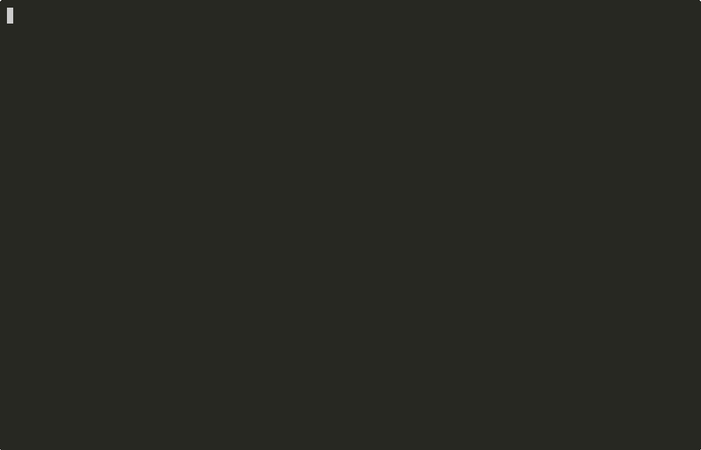

# 🚂 chugchug

**Next-generation progress bars for Python.** Event-driven, multiprocessing-safe, pipeline-aware.

*Zero dependencies. Beautiful gradients. Smart ETA. Just works.*

<p align="center">
  
</p>

## Why chugchug?

| Feature | tqdm | Rich | **chugchug** 🚂 |
|---|---|---|---|
| Zero dependencies | yes | no | **yes** |
| Event-driven architecture | no | no | **yes** |
| Multiprocessing (spawn-safe) | no | no | **yes** |
| Pipeline/DAG progress | no | no | **yes** |
| "Why is it slow?" diagnostics | no | no | **yes** |
| Beautiful gradient bars | no | yes | **yes** |
| Smart ETA (regression + ensemble) | no | no | **yes** |
| ML metrics (loss, lr, auto-colored) | no | no | **yes** |
| Notebook support (HTML/CSS bars) | partial | yes | **yes** |
| JSON/LOG/TTY output modes | partial | no | **yes** |
| Smart generator wrapping | no | no | **yes** |
| tqdm drop-in compatible | - | no | **yes** |

## 🚀 Install

```bash
pip install chugchug
```

## 🚂 Quick Start

```python
from chugchug import chug

for item in chug(range(100), desc="Working"):
    process(item)
```

That's it. One import, one line. Gradient bar, smart ETA, speed tracking — all automatic.

## 🎨 Gradients

14 built-in gradient presets:

```python
chug(data, gradient="ocean")    # blue → cyan (default)
chug(data, gradient="fire")     # red → gold
chug(data, gradient="rainbow")  # full spectrum
chug(data, gradient="aurora")   # northern lights
chug(data, gradient="candy")    # pink → purple → cyan → green
chug(data, gradient="neon")     # magenta → cyan → yellow
# + forest, purple, cyber, mono, heatmap, sunset, matrix, ice
```

Custom gradients:

```python
from chugchug import register_gradient, register_multi_gradient

register_gradient("coral", (255, 94, 77), (255, 195, 113))
register_multi_gradient("vaporwave", [
    (255, 0, 128), (128, 0, 255), (0, 200, 255), (0, 255, 180),
])
```

## 🧠 ML Training

```python
from chugchug import Chug

b = Chug(total=num_steps, desc="Training", gradient="fire", unit="step")
for step in range(num_steps):
    loss, acc = train_step()
    b.set_metrics(loss=f"{loss:.4f}", acc=f"{acc:.1%}")
    b.update()
b.close()
```

Metrics like `loss` auto-color green when improving, red when worsening.

## 🔄 tqdm Drop-in

```python
# Before
from tqdm import tqdm

# After — just change the import
from chugchug.compat import tqdm, trange
```

## 🪄 Smart Generators

tqdm shows `0it [00:00, ?it/s]` for `map()`, `enumerate()`, generator expressions. chugchug extracts the total automatically:

```python
chug(map(fn, data))          # detects total from data
chug(enumerate(data))        # works too
chug(x**2 for x in data)    # even generator expressions
```

## 📓 Notebooks

Auto-detected in Jupyter — renders as HTML/CSS gradient bars:

```python
for item in chug(range(100), desc="Training"):
    process(item)
```

Or force it: `chug(data, output="notebook")`.

## 🏗️ Pipelines

```python
from chugchug._pipeline import Pipeline

pipe = Pipeline("ETL")
pipe.add_stage("extract", total=1000, desc="Extracting")
pipe.add_stage("transform", total=1000, depends_on=["extract"])
pipe.add_stage("load", total=1000, depends_on=["transform"])

with pipe:
    # stages run with progress tracking, bottleneck detection
    ...
```

## ⚡ Multiprocessing

Spawn-safe. No shared memory. Just works.

```python
from chugchug._mp import MPContext
from concurrent.futures import ProcessPoolExecutor

with MPContext() as ctx:
    with ProcessPoolExecutor(max_workers=4) as pool:
        for i in range(4):
            t = ctx.tracker(f"worker-{i}", total=100)
            pool.submit(work, t)
```

## 🔍 Diagnostics

```python
for item in Chug(range(10000), desc="Analysis", diagnostics=True):
    process(item)
# [chugchug diagnostic] CPU-BOUND: Consider multiprocessing...
```

## 📊 Output Modes

```python
chug(data, output="tty")       # terminal with gradients (default)
chug(data, output="notebook")  # HTML/CSS bars for Jupyter
chug(data, output="json")      # structured JSON lines for CI/CD
chug(data, output="log")       # human-readable log lines
chug(data, output="silent")    # tracking only, no output
```

## 🏛️ Architecture

chugchug separates **tracking** from **rendering**:

- **Trackers** produce `ProgressEvent` objects (immutable, picklable)
- **Registry** dispatches events to handlers (lock-free hot path)
- **Handlers** render output (TTY, Notebook, JSON, LOG, custom)

## CLI

```bash
cat urls.txt | python -m chugchug pipe --desc "Downloading"
python -m chugchug watch progress.jsonl
python -m chugchug replay recording.jsonl --speed 2.0
```

## License

MIT
